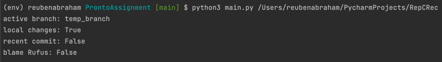

# Pronto.ai Take home Assignment

## Problem Requirements

- The program should take one argument: `git_dir`: directory in which to assess git status.
- Your program should print the following things:
  - active branch (branch name)
  - whether repository files have been modified (boolean)
  - whether the current head commit was authored in the last week (boolean)
  - whether the current head commit was authored by Rufus (boolean)

## Running Instructions

- Have Python 3.9+ installed on your machine. 
- Clone the repository to your local machine : `git clone https://github.com/reubenabraham/ProntoAssignment.git`
- Navigate to the repository location, then follow instructions [here](https://packaging.python.org/en/latest/guides/installing-using-pip-and-virtual-environments/) to install `venv`, create a virtual environment (`python3 -m venv env`) and activate the virtual environment (`source env/bin/activate`).
- From within the virtual environment, install requirements `pip install -r requirements.txt`
- `pip freeze` to confirm you have `GitPython` installed.
- Run `python3 main.py _full_path_to_repository_` - output is printed to stdout.
- Sample run output looks like so :

### Additional Points to Note :

- Point two of the requirements says return T/F based on "whether repository files have been modified" 
  - As per my interpretation of this rule, my program will yeild `True` when there are modified local files that already belonged to the repository AND these files are in the unstaged state- meaning they have not been 'git added'. 
  - When a 'repository' file is modified and is 'added'/'staged', my program will yeild `False`.
  - When a 'non-repository' file is added, or if any changes are made to the 'non-repository' file, my program will yeild `False`.

- This program will raise ValueErrors in certain cases of unexpected behaviour including :
  - When either no command-line arguments are given, or greater than one number of arguments are given. This program expects exactly one argument - the full repository path.
  - When the given repository path is invalid or doesn't exist.
  - When the provided path is not a valid 'git repository'.
  - When there are zero commits on the given repository. Part c and d of the question require the repository to have at least one commit.